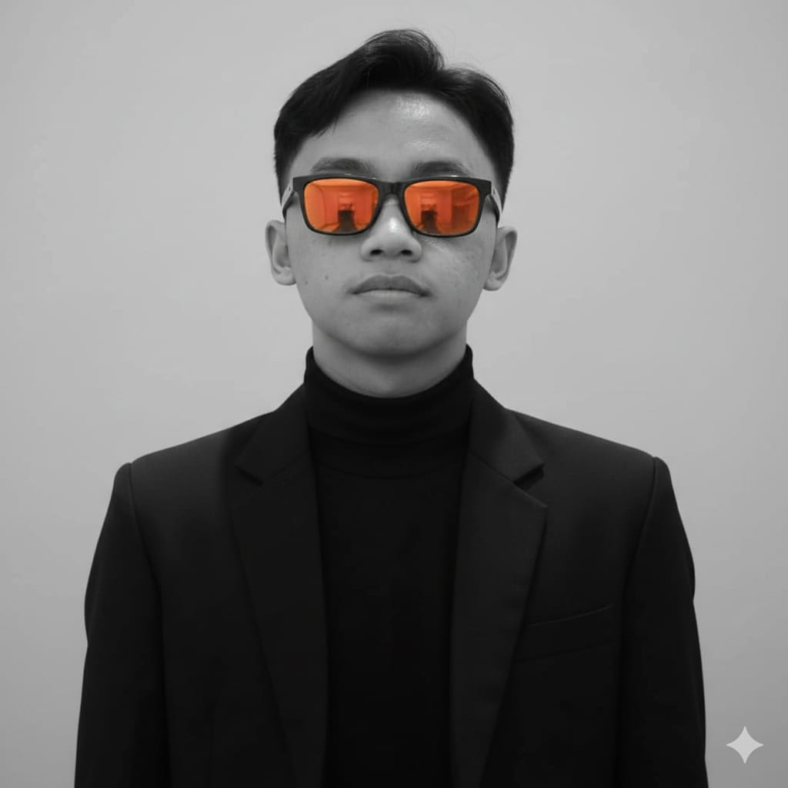

  
  

  I'm a Software Engineering student based in Semarang, passionate about building impactful digital solutions. 
  I specialize in full-stack web development and mobile applications, with a keen interest in workflow automation and AI. 
  My goal is to empower local businesses (UMKMs) by transforming manual processes into efficient, automated, and intelligent systems.

  
  
  
  

<h3>📚 About Me</h3>

- 🎓 **Education:** Pursuing a degree in **Teknologi Rekayasa Perangkat Lunak** (Software Engineering) in Semarang.
- 💻 **Tech Stack:** Specialized in **Laravel**, **Livewire**, and **Tailwind CSS** for web, and **Flutter** with GetX for mobile.
- 🤖 **Automation:** Building agentic AI workflows and Telegram bots using **n8n** and **Gemini AI**.
- 👨‍💼 **Experience:** 6 months as a **Meta Ads Advertiser** at a charity foundation, managing digital campaigns.
- 🧩 **Philosophy:** Solving complex business problems through clean, maintainable code and smart automation.

 

<h3>🌿 What I'm Building Toward</h3>

<table>
  <tr>
    <td width="50%" valign="top">
      <strong>🌱 Direction</strong>
      <ul>
        <li>Scalable web applications for local enterprises (UMKM).</li>
        <li>Automated business workflows that reduce manual data entry.</li>
        <li>Integrating AI agents into daily production environments.</li>
      </ul>
    </td>
    <td width="50%" valign="top">
      <strong>🔭 Current Focus</strong>
      <ul>
        <li>Developing **Hifdz Tracker** for digital educational progress.</li>
        <li>Building an **Underwater Drone (ROV)** university project.</li>
        <li>Exploring **Midtrans** & payment gateway integrations.</li>
      </ul>
    </td>
  </tr>
</table>

<h3>🧰 Tech Garden</h3>

  
  
  
  
  
  
  
  
  
  
  

<h3>🌲 Forest Activity</h3>

<table align="center">
  <tr>
    <td width="49%" valign="top">
      
    </td>
    <td width="2%"></td>
    <td width="49%" valign="top">
      
       
      
    </td>
  </tr>
</table>

